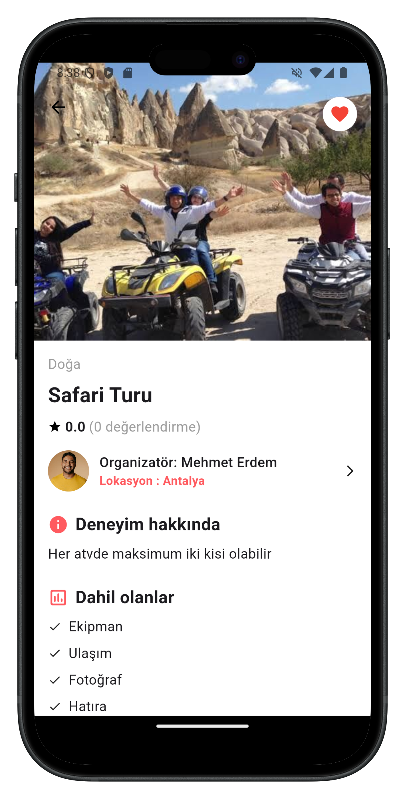

## 📌 Overview
Real Estate and Tour is a dual-purpose platform that allows users to list rental properties and travel/tour activities. Built with Flutter for the frontend, Node.js for the backend, and MongoDB for the database, it offers a comprehensive solution for property rentals and travel experiences.

## ✨ Key Features

### 🏠 Property & Travel Listings
Create and manage rental property listings

Post travel/tour activities and experiences

Detailed listing pages with images, descriptions, and amenities

### 🔐 User Management
Secure registration and login system

User profiles with customizable information

Profile settings and editing capabilities

### 💖 Favorites & Interactions
Save favorite listings for quick access

Browse other users' profiles

### 📅 Reservation System
Request reservations for properties or tours

Owners can approve/decline reservation requests

Track reservation statuses (pending/approved/declined)

### 🔍 Search & Filtering
Advanced search functionality

Filter listings by various criteria

Date range selection for availability

### 🤖 AI Travel Assistant
Powered by Google Gemini 2.0 Flash model

Provides smart travel recommendations

Suggests vacation ideas and activities

### ⭐ Review System
Dual-sided reviews (guest ↔ host)

Rating criteria with multiple dimensions

Moderation queue for quality control

Verified stays requirement

### 🎫 Support Ticket System
User ticket submission flow

Admin response and resolution tracking

Priority categorization

Status tracking (Open/In Progress/Resolved)

### 📟 Admin Management
Complete CRUD operations for all entities

User management with role-based access

## 📱 Screenshots

  
  
  
  
  
  
  
  
  
  
  
  
  
  
  
  
  
  
  
  
  
  
  
  
  
  
  
  
  
  
  
  
  
  
  
  
  

## 🛠️ Technical Stack

### Frontend (Flutter)
State Management: Provider

API Communication: http, http_parser

Connectivity: connectivity_plus

Local Storage: shared_preferences

UI Components: flutter_rating_bar

Media Handling: image_picker

Utilities: logger, intl

AI Integration: google_generative_ai

### Backend (Node.js)
Framework: Express

Database: Mongoose (MongoDB ODM)

Authentication: jsonwebtoken, bcrypt

File Upload: multer

Logging: morgan

Security: cors

Configuration: dotenv

